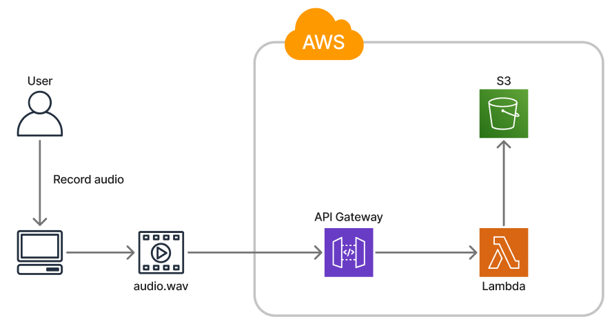

# Audio Transcription App with AWS and Next.js

This project is a **full-stack serverless application** that allows users to:

- Record audio directly in the browser
- Upload the audio file to **AWS S3**
- Automatically start a **transcription job** using **Amazon Transcribe**
- Retrieve the transcription and display it dynamically

Built with:
- [Next.js 15 (App Router)](https://nextjs.org/)
- [AWS Lambda](https://aws.amazon.com/lambda/)
- [Amazon S3](https://aws.amazon.com/s3/)
- [Amazon Transcribe](https://aws.amazon.com/transcribe/)
- [Amazon DynamoDB](https://aws.amazon.com/dynamodb/)
- [Terraform](https://www.terraform.io/) for infrastructure as code
- [mic-recorder-to-mp3](https://www.npmjs.com/package/mic-recorder-to-mp3) for clean MP3
---
### AWS Architecture

## How to run the app

### Clone the repository

```bash 
git clone https://github.com/your-repo/my-audio-app.git
cd my-audio-app
```

### Install dependencies & set up set up environmental variables

```bash
npm install
cp .env.example .env.local
```

### Edit <code>.env.local</code> and set the API Gateway URL:
Update the API Gateway URL with the API Gateway created from the Terraform deployment on AWS.
```bash
NEXT_PUBLIC_API_URL=https://your-api-gateway.amazonaws.com
NEXT_PUBLIC_DYNAMODB_TABLE_NAME=Transcriptions
```

### Install dependencies for lambda functions and package lambda functions for deployment

Make sure that the system has Python 3.8+ installed. Navigate to <code>/lambda</code> directory.

```bash
cd lambda
chmod +x package.sh package_process.sh
./package_all.sh
```

### Set Up AWS Infrastructure with Terraform

Make sure that you have the AWS CLI configured with your credentials for AWS. Refer to [AWS CLI documentation for guidance](https://docs.aws.amazon.com/cli/latest/userguide/cli-chap-getting-started.html).

Navigate to the <code>/terraform</code> folder.

```bash
cd terraform
```

Initialize, validate, plan, and apply Terraform.

```bash
terraform init
terraform validate
terraform plan
terraform apply
```

<code>output.tf</code> is set to output the API Gateway URL. So update <code>NEXT_PUBLIC_API_URL=https://your-api-gateway.amazonaws.com</code> in <code>.env.local</code>with the output API Gateway URL.

### Next.js

First, run the development server:

```bash
npm run dev
# or
yarn dev
# or
pnpm dev
# or
bun dev
```

### Destroy AWS infrastructure with Terraform

Delete the audio file and transcriptions from the S3 bucket. Then destroy your AWS resources.
```bash
terraform destroy
```
Verify that the S3, Lambda function, and API Gateway have been destroyed.